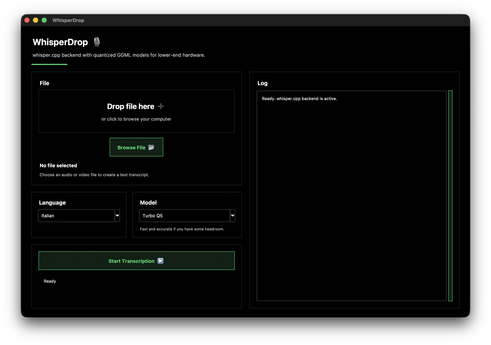

# WhisperDrop

WhisperDrop is a desktop transcription app for local audio/video files and YouTube links. It uses `whisper.cpp` with quantized GGML models, so it can run on lower-end hardware without requiring a cloud transcription service.



## Features

- Drag and drop one or more audio or video files
- Paste a YouTube video or playlist link and queue it for transcription
- Supports `.mp3`, `.wav`, `.m4a`, `.ogg`, `.flac`, `.opus`, `.webm`, `.mp4`, and `.aac`
- Uses quantized GGML models from `whisper.cpp`
- Downloads models automatically on first use and caches them locally
- Uses Metal on macOS when the local `whisper.cpp` build supports it, with CPU fallback
- Uses Vulkan on Windows when available, with CPU fallback
- Saves one `.txt` transcript per source item
- Provides a two-column UI with a live log panel

## Download

For macOS, use the packaged artifact from GitHub Releases when available:

1. Download `WhisperDrop-1.0.0.dmg` from the Releases page.
2. Open the DMG.
3. Drag `WhisperDrop.app` into `Applications`.
4. Open `WhisperDrop` from Applications or Spotlight.

The macOS app stores its runtime environment, downloaded tools, and model cache in:

```text
~/Library/Application Support/WhisperDrop
```

If macOS blocks the app because it was downloaded from the internet, right-click `WhisperDrop.app`, choose **Open**, then confirm once.

## Requirements

- macOS or Windows
- Internet connection for first setup, YouTube downloads, and first use of each model
- Enough disk space for selected models. Turbo Q5 is about 547 MB; Turbo Q8 is about 874 MB.

## Install From Source

### macOS

```bash
git clone https://github.com/LucaArisci/whisper-drop.git
cd whisper-drop
chmod +x WhisperDrop.command WhisperDrop_installer.command scripts/setup.sh
./scripts/setup.sh
```

Then run either:

```bash
./WhisperDrop.command
```

or build a macOS app bundle:

```bash
./script/build_and_run.sh --verify
```

This creates `dist/WhisperDrop.app`.

To create a release DMG:

```bash
./scripts/package_dmg.sh 1.0.0
```

The DMG is written to `build/package/WhisperDrop-1.0.0.dmg`.

### Windows

```powershell
git clone https://github.com/LucaArisci/whisper-drop.git
cd whisper-drop
powershell -ExecutionPolicy Bypass -File .\scripts\setup.ps1
```

Or double-click `WhisperDrop_installer.bat`.

The Windows setup installs Python 3.11 if needed, prepares a local virtual environment, installs `yt-dlp`, downloads or builds the required media tools, and prepares `whisper.cpp` with Vulkan support where possible.

## Usage

1. Open `WhisperDrop`.
2. Drag and drop local audio/video files, or paste a YouTube video/playlist link and click **Load Playlist**.
3. Choose the language and model.
4. Click **Start Transcription**.
5. Local file transcripts are saved next to the original file. YouTube transcripts are saved under `Downloads/WhisperDrop`.

## Models

Models are downloaded from the [`ggerganov/whisper.cpp`](https://huggingface.co/ggerganov/whisper.cpp) Hugging Face repository.

| Model | Approx. size | Speed | Best for |
| --- | ---: | --- | --- |
| Tiny Q5 | 32 MB | Fastest | Older or slower hardware |
| Base Q5 | 57 MB | Fast | Balanced lightweight use |
| Small Q5 | 190 MB | Medium | Better accuracy on common audio |
| Medium Q5 | 515 MB | Slow | Higher accuracy |
| Turbo Q5 | 547 MB | Fast | Recommended default |
| Turbo Q8 | 874 MB | Medium | Higher quality quantized output |

## Development

Run the app directly:

```bash
.venv/bin/python transcriber.py
```

Run with hot reload:

```bash
.venv/bin/pip install watchdog
.venv/bin/python scripts/dev.py
```

Build and verify the macOS app bundle:

```bash
./script/build_and_run.sh --verify
```

Package a DMG:

```bash
./scripts/package_dmg.sh 1.0.0
```

## Project Structure

```text
whisper-drop/
|-- assets/
|   |-- app-icon/                  # macOS app icon source
|   `-- screenshot.png             # README screenshot
|-- script/
|   `-- build_and_run.sh           # Build and launch helper for macOS app bundle
|-- scripts/
|   |-- build_macos_app.sh         # Creates dist/WhisperDrop.app
|   |-- package_dmg.sh             # Creates build/package/WhisperDrop-<version>.dmg
|   |-- setup.sh                   # macOS setup script
|   |-- setup.ps1                  # Windows setup script
|   `-- dev.py                     # Development hot-reload launcher
|-- transcriber.py                 # Main Tkinter app
|-- WhisperDrop.command            # macOS source launcher
|-- WhisperDrop.bat                # Windows launcher
|-- WhisperDrop_installer.command  # macOS installer launcher
|-- WhisperDrop_installer.bat      # Windows installer launcher
|-- requirements.txt
|-- LICENSE
`-- README.md
```

Generated folders such as `.venv/`, `.tools/`, `.models/`, `dist/`, and `build/` are intentionally ignored.

## License

MIT
